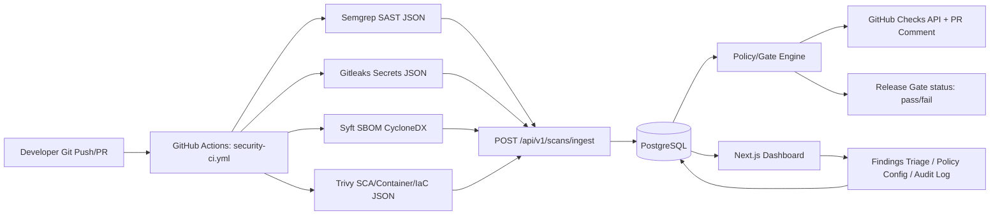

# DevSecOps Software Supply-Chain Platform

Copyright © Bibas Gautam. All rights reserved.

A self-hosted platform that orchestrates open-source security scanners (Semgrep, Trivy, Gitleaks,
Syft/CycloneDX) across your own GitHub repositories, normalizes their findings into one data model,
applies configurable policy gates, and reports results back to pull requests and a web dashboard.

> **Scope & safety notice**: This platform only scans repositories you explicitly connect via your
> own GitHub App/PAT credentials. It does not perform network scanning, exploitation, or scanning of
> systems/repositories you do not own or have not authorized. Automated actions that change a
> release's pass/fail gate or open a fix PR are logged and, where configured, require human approval.

---

## 1. Feature Checklist (source requirements → implementation)

| # | Requirement | Status | Where |
|---|---|---|---|
| 1 | SAST | ✅ Semgrep integration | `backend/app/integrations/semgrep.py`, `.github/workflows/security-ci.yml` |
| 2 | SCA (dependency) | ✅ Trivy `fs`/`repo` scan + Syft SBOM cross-check | `integrations/trivy.py` |
| 3 | Secrets scanning | ✅ Gitleaks, findings redacted at ingest | `integrations/gitleaks.py` |
| 4 | SBOM | ✅ Syft → CycloneDX JSON, stored & viewable | `integrations/syft.py`, `/sboms` API |
| 5 | Container scanning | ✅ Trivy `image` scan | `integrations/trivy.py` |
| 6 | IaC scanning | ✅ Trivy `config` scan (Terraform/K8s/Dockerfile) | `integrations/trivy.py` |
| 7 | License policy | ✅ License extraction from SBOM + allow/deny policy engine | `policy/license_policy.py` |
| 8 | PR reporting | ✅ GitHub Checks API + PR comment with findings summary | `services/github_reporting.py` |
| 9 | Security gates | ✅ Configurable severity/license/secret thresholds, blocks merge via required check | `policy/gate_engine.py` |

## 2. Architecture

```
Git Push / PR
      │
      ▼
GitHub Actions (security-ci.yml)
  ├─ Semgrep (SAST)        ─┐
  ├─ Gitleaks (secrets)     │  each produces JSON artifact
  ├─ Syft (SBOM/CycloneDX)  │
  └─ Trivy (SCA/container/IaC) ┘
      │  (uploads normalized findings)
      ▼
Backend API  (FastAPI, JWT auth, RBAC)
      │
      ▼
Findings Normalizer → PostgreSQL (projects, scans, findings, sboms, policies, audit_log)
      │
      ▼
Policy / Gate Engine  (severity thresholds, license allow/deny, secret block)
      │
      ├─► GitHub Checks API + PR comment  (Developer Feedback)
      └─► Release Gate decision (pass/fail, required GitHub status check)
      │
      ▼
Frontend Dashboard (Next.js) — triage findings, view SBOM, configure policy, audit trail
```

Data-flow diagram (Mermaid, also renders on GitHub):



## 3. Technology Stack

| Layer | Choice | Why |
|---|---|---|
| Frontend | Next.js 14 (App Router) + TypeScript + Tailwind | SSR dashboard, fast iteration, good DX |
| Backend | FastAPI (Python 3.11) | Async, first-class OpenAPI docs, great fit for glueing CLI scanners |
| DB | PostgreSQL 16 | JSONB for raw scanner payloads + relational integrity for policy/audit |
| Migrations | Alembic | Standard for SQLAlchemy |
| Auth | JWT (access+refresh), passlib/bcrypt | Stateless API auth, simple RBAC |
| CI | GitHub Actions | Requirement-specified; native PR/Checks API integration |
| Scanners | Semgrep, Trivy, Gitleaks, Syft | Requirement-specified, all OSS, no vendor lock-in |
| Container | Docker / Docker Compose | Local + reproducible deployment |
| Tests | pytest, httpx, pytest-asyncio; Vitest for frontend | Async API testing, component testing |

## 4. Project Structure

```
devsecops-platform/
├── backend/
│   ├── app/
│   │   ├── api/            # FastAPI routers (auth, projects, scans, findings, sboms, policies, audit)
│   │   ├── core/            # config, security, logging
│   │   ├── db/               # session, base
│   │   ├── models/          # SQLAlchemy ORM models
│   │   ├── schemas/          # Pydantic schemas
│   │   ├── services/         # business logic (github_reporting, ingestion)
│   │   ├── policy/           # gate_engine, license_policy
│   │   ├── integrations/     # per-scanner JSON normalizers
│   │   └── main.py
│   ├── alembic/               # migrations
│   ├── tests/
│   ├── requirements.txt
│   └── Dockerfile
├── frontend/
│   ├── src/app, components, lib
│   ├── package.json
│   └── Dockerfile
├── .github/workflows/security-ci.yml
├── scripts/ (setup.bat, start.bat, stop.bat, restart.bat, health-check.bat + .sh equivalents)
├── infra/docker/docker-compose.yml
├── docs/ (THREAT_MODEL.md, API.md, ERD.md)
├── .env.example
└── README.md
```

## 5. Setup (Windows)

```bat
scripts\setup.bat      REM installs deps, creates venv, runs migrations, seeds demo data
scripts\start.bat      REM docker compose up -d (db) + starts backend & frontend
scripts\stop.bat
scripts\restart.bat
scripts\health-check.bat
```

## 6. Setup (Docker Compose, cross-platform)

```bash
cp .env.example .env      # edit secrets
docker compose -f infra/docker/docker-compose.yml up --build
```

- Backend: http://localhost:8000 (docs at `/api/docs`)
- Frontend: http://localhost:3000
- Postgres: localhost:5432

## 7. Configuration

See `.env.example` for the full list. Key variables:

| Variable | Required | Purpose |
|---|---|---|
| `DATABASE_URL` | yes | Postgres connection string |
| `JWT_SECRET_KEY` | yes | Signs access/refresh tokens — **generate your own, never commit** |
| `GITHUB_APP_ID` / `GITHUB_APP_PRIVATE_KEY` / `GITHUB_WEBHOOK_SECRET` | only if using live GitHub PR reporting | Lets the platform post Check Runs/PR comments. **Not configured = PR reporting endpoints return 501 with a clear message; scanning/storage/dashboard still work fully offline with demo data.** |
| `INGEST_API_KEY` | yes | Shared secret the GitHub Actions workflow uses to call the ingest endpoint |

**No external integration is claimed to work without these being set.** Without `GITHUB_APP_*`, the
platform runs entirely on demo/local data and the GitHub-reporting service returns an explicit
"not configured" error rather than silently no-op'ing.

## 8. Testing

```bash
cd backend && pytest -v --cov=app
cd frontend && npm test
```

## 9. Troubleshooting

- **`alembic` fails with "target database is not up to date"** → run `alembic upgrade head` inside `backend/`.
- **GitHub Actions step fails on `INGEST_API_KEY`** → set it as a repo secret matching your `.env`.
- **PR comment not posting** → confirm `GITHUB_APP_ID/PRIVATE_KEY` are set; check `/api/v1/health/github` for connectivity status.
- **Port already in use** → edit `infra/docker/docker-compose.yml` port mappings.

## 10. Known Limitations

- Demo seed data (`backend/app/db/seed.py`) is synthetic — clearly marked, never presented as live findings.
- GitHub App integration requires the user's own GitHub App registration; this repo does not ship a working App ID.
- Auto-fix PR suggestions are generated as diffs but require human approval before merge (no auto-merge).
- Single-tenant by default; multi-org support would need additional tenancy isolation (not implemented here).

## 11. License

This project's own code is © Bibas Gautam, all rights reserved (see `LICENSE`). It orchestrates and
depends on third-party OSS tools — Semgrep (LGPL 2.1 for the CLI / rules vary), Trivy (Apache-2.0),
Gitleaks (MIT), Syft (Apache-2.0), FastAPI (MIT), Next.js (MIT) — each under its own license; see
`docs/THIRD_PARTY_LICENSES.md`.
